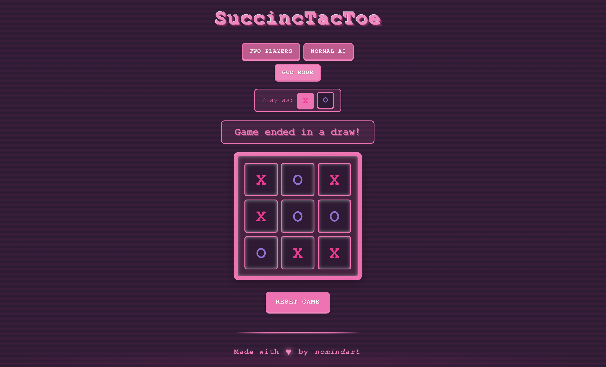

# SuccincTacToe 🎮

<div align="center">
  
  
  
  
</div>

<div align="center">
  <p><strong>A retro-themed Tic Tac Toe game with AI opponents built with Next.js</strong></p>
  <p>Play the classic game with a stylish pink retro twist!</p>
</div>

<p align="center">
  
</p>

## ✨ Features

- **Three Game Modes**:
  - 🧑‍🤝‍🧑 **Two Players** - Play locally with a friend
  - 🤖 **Normal AI** - Play against a computer that occasionally makes mistakes
  - 👾 **God Mode** - Face an unbeatable AI that uses the minimax algorithm

- **Customizable Play**:
  - Choose to play as either X or O when playing against the computer
  - X always goes first, so choosing O lets the computer make the first move

- **Responsive Design**:
  - Optimized for mobile, tablet, and desktop
  - Beautiful animations and transitions
  - Fully accessible with keyboard navigation and ARIA attributes

- **Retro Aesthetic**:
  - Pink color palette with nostalgic design elements
  - CRT scanlines effect
  - Pixel-inspired fonts and button styling
  - Hover effects and animations for an arcade-like feel

## 🚀 Getting Started

### Prerequisites

- Node.js 18.0 or later
- npm or yarn

### Installation

1. **Clone the repository**:
   ```bash
   git clone https://github.com/0xNomind/succinctactoe.git
   cd succinctactoe
   ```

2. **Install dependencies**:
   ```bash
   npm install
   # or
   yarn install
   ```

3. **Run the development server**:
   ```bash
   npm run dev
   # or
   yarn dev
   ```

4. **Open your browser**:
   Navigate to [http://localhost:3000](http://localhost:3000) to play the game!

## 🎮 How to Play

1. **Choose a Game Mode** by clicking one of the three buttons at the top.
2. **If playing against AI**, choose whether you want to play as X or O.
3. **Take turns** placing your mark (X or O) on the board by clicking on an empty square.
4. **Win** by getting three of your marks in a horizontal, vertical, or diagonal row.
5. **Reset** the game at any time using the Reset Game button.

## 🧠 AI Implementation

- **Normal Mode** uses a weighted randomization strategy:
  - 70% of the time it makes the optimal move
  - 30% of the time it makes a random move
  - This gives players a fair chance to win

- **God Mode** uses the minimax algorithm:
  - Examines all possible future game states
  - Always chooses the most advantageous move
  - Cannot be beaten (best outcome is a draw)

## 🛠️ Technologies Used

- **Next.js**: React framework for server-rendered applications
- **TypeScript**: For type-safe code
- **Tailwind CSS**: For styling
- **CSS Variables**: For theme customization
- **React Hooks**: For state management

## 📱 Responsive Design

- **Desktop**: Full-sized game board with hover effects
- **Tablet**: Optimized layout with appropriate sizing
- **Mobile**: Compact design with touch-friendly controls

## 🎨 Customization

The game's appearance can be easily customized by modifying the CSS variables in `globals.css`:

```css
:root {
  --background: #ffe6f2;
  --foreground: #ff1493;
  --primary: #ff69b4;
  --secondary: #ffb6c1;
  --accent: #ff007f;
  --border: #ff69b4;
  --board-bg: #ff80bf;
  --x-color: #ff1493;
  --o-color: #9370db;
}
```

## 📝 License

This project is licensed under the MIT License - see the LICENSE file for details.
